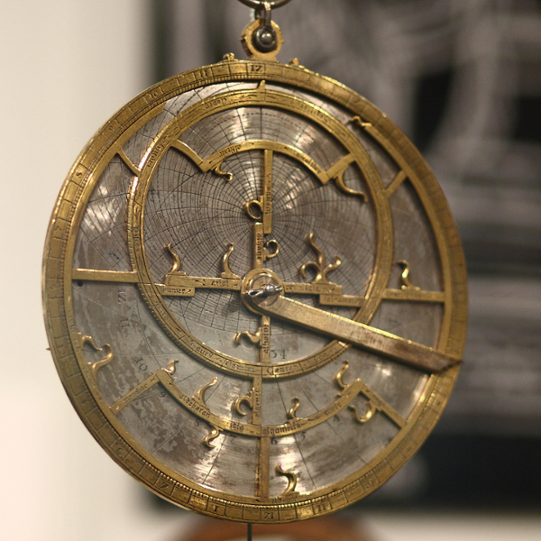
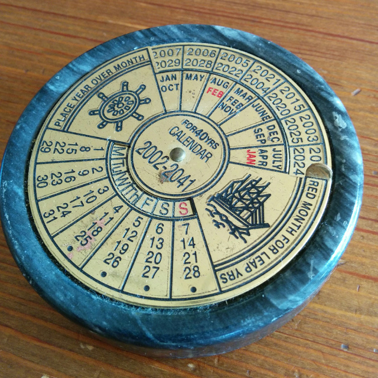
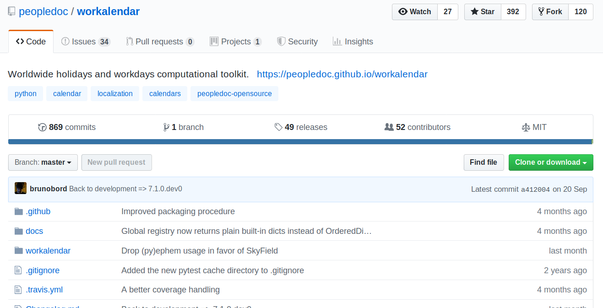
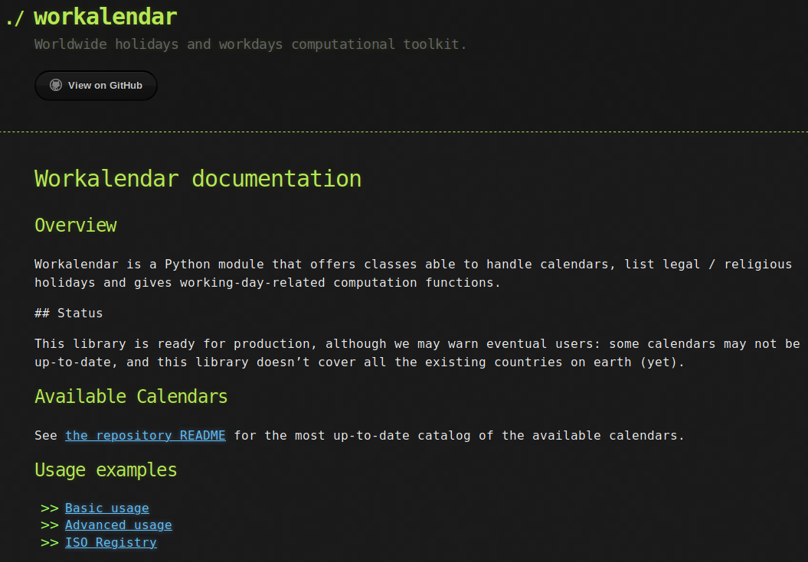
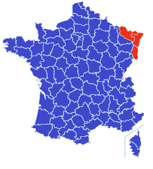
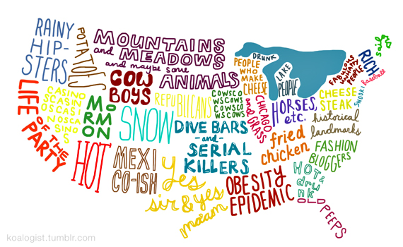
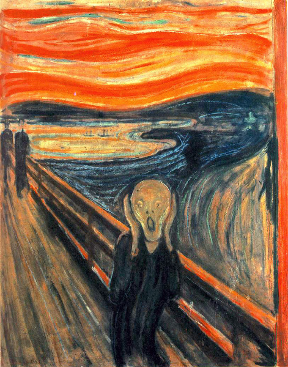
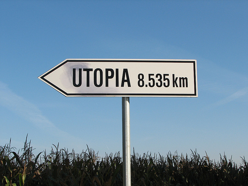

# Workalendar

#### cette bibliothèque qui ne prend jamais de vacances

----

# /me

* Bruno Bord
* 45 ans ½
* Dev "Web" depuis 2001
* Dév Python/Django/Python depuis 2007
* Bayonne, Pays Basque depuis 2000

~~

# Taff

* Novapost (2013)
* ⇒ PeopleDoc
* ⇒ Rachat par Ultimate Software en 2018.

<small><small>on recrute</small></small>

----

# Au commencement…

----


<small><small>probablement un lundi</small></small>

----

# Peopleask

~~

# Action

> affecter une date prévue de traitement (généralement contractuelle) à J+10 **jours ouvrés**

~~

# Fastoche !

* On déroule les jours,
* Si ouvré on *incrémente*,
* Si férié **OU** samedi/dimanche on *skippe*
* Quand on arrive à 10, on ``return``

~~

# Devant un problème

1. On cherche une lib qui correspond au besoin
2. On fabrique une lib qui correspond au besoin
3. On vise au-delà…

~~

# Pourquoi se limiter à la France ?

~~

# Recherche

~~


~~



~~



~~

# PyPI

* un module très pointu: ``icelandic_holidays``,
* un autre tout aussi pointu: ``czech-holidays``.
* un module Brazil + UK + Poland (MAIS POURQUOI ?),

et… ?

~~

# Techniquement

* trop centrés sur un pays
* pas ou peu extensibles
* pas possible de passer outre certaines *dates*
* pas de fonction du genre "*J + 7 jours ouvrés*"

~~

# …

> Parfois le meilleur moyen d'avoir une roue ronde c'est de la faire soi-même

~~

# Naming things

```
< brunobord> oyez, oyez
< brunobord> je cherche un nom pour le module de calendrier
             mondial
< brunobord> allez-y
< zebuline> workalendar ?
< Hobbestigrou> ah oui c'est pas mal
< Hobbestigrou> je trouve
< brunobord> je note
```

----

# La base

~~

# La base

- Nous sommes le 2 novembre 2019
- Une année, c'est 365 jours <!-- .element: class="fragment" data-fragment-index="1" -->
- On travaille du lundi au vendredi inclus <!-- .element: class="fragment" data-fragment-index="2" -->
- On a tous la même définition d'un jour férié (e.g. Pâques, Ramadan…) <!-- .element: class="fragment" data-fragment-index="3" -->
- Les jours fériés d'un pays ne varient jamais <!-- .element: class="fragment" data-fragment-index="4" -->
- Le Père Noël existe <!-- .element: class="fragment" data-fragment-index="5" -->

~~

# Quiz

## Année (solaire) bissextile ?

~~

# Bissextile

* Si divisible par 4 ⇒ 366 jours <!-- .element: class="fragment" data-fragment-index="1" -->
* Sauf si divisible par 100 ⇒ 365 jours <!-- .element: class="fragment" data-fragment-index="2" -->
* Sauf si divisible par 400 ⇒ 366 jours <!-- .element: class="fragment" data-fragment-index="3" -->
* Le reste ⇒ 365 jours  <!-- .element: class="fragment" data-fragment-index="4" -->

Astronomiquement, une année ⇒ 365,2421898 jours <!-- .element: class="fragment" data-fragment-index="5" -->

<small>Ouf ! le module ``datetime`` connaît les années bissextiles</small>   <!-- .element: class="fragment" data-fragment-index="4" -->


----

# Bienvenue en 'Pataphysique

----

# Workalendar v0.0.0

----

# Objectifs

* Boîte à outils ⇒ calendrier France + *LE MONDE* ?!? ⇒ extensible / modulaire
* Fonctions intégrées (``is_working_day``, ``add_working_days``)
* Débrayable (forcer un jour travaillé ou chômé)
* Libre (yay!)
* 100% testée

~~

## Github

https://github.com/peopledoc/workalendar



~~



----

# État(s) du Monde

----


<small><small>Avant le café du matin</small></small>

~~

# Chaos

* langues 👻
* alphabets 🕷️ (Unicode) 🦇
* ☠️ formats de date 🧛
* 🎃 timezones 🦂
* conduite 🕸️ à droite ou à gauche 💀

----

## Simple

# France

* Calendrier grégorien
* Fêtes Chrétiennes
* Variables : Pâques
* Jours fixes : 15 août, 1er janvier, 14 juillet

~~

# France

* **Fixes** : Jour de l'An, Fête du travail, Fête de la Victoire de 1945, Fête Nationale, Assomption, Toussaint, Armistice 1918, Noël.
* **Variables** : Lundi de Pâques, Jeudi de l'Ascension, Lundi de Pentecôte.

~~

# Et là, c'est le drame

~~

# Alsace/Moselle



~~

# Alsace/Moselle

== France + Vendredi Saint + 26 Décembre

~~

# Quiz

## Règle de calcul de Pâques ?

> Pâques est le dimanche qui suit la première pleine lune du printemps  
> -- Concile de Nicée (en 325)    <!-- .element: class="fragment" data-fragment-index="1" -->

Pâques tombe entre le 22 mars et le 25 avril  <!-- .element: class="fragment" data-fragment-index="2" -->

~~

## Pourquoi Pâques est si important ?

* Lundi Pur = 48 jours avant (début du carême)
* Mercredi des Cendres = 46 jours avant
* Dimanche des Rameaux = 7 jours avant
* Jeudi / Vendredi / Samedi Saint = 3, 2, 1 jour(s) avant
* Lundi de Pâques = le lendemain
* Jeudi de l'Ascension = 39 jours après
* Lundi de Pentecôte = 50 jours après
* Corpus Christi = 60 jours après

~~

# `dateutil`

```python
>>> from dateutil import easter
>>> easter.easter(2019)
datetime.date(2019, 4, 21)
```

<small>teaser : y'a un piège</small>

----

# US of A.



~~

## US of Alambiqué

* "Le premier lundi de mars",
* "Le second lundi d'octobre",
* "Le jour de l'élection présidentielle" (tous les 4 ans, donc)

~~

## US of Alambiqué

```python
@staticmethod
def get_nth_weekday_in_month(year, month, weekday, n=1):
    """Get the nth weekday in a given month. e.g:

    >>> # the 1st monday in Jan 2013
    >>> Calendar.get_nth_weekday_in_month(2013, 1, MON)
    datetime.date(2013, 1, 7)
    >>> # The 2nd monday in Jan 2013
    >>> Calendar.get_nth_weekday_in_month(2013, 1, MON, 2)
    datetime.date(2013, 1, 14)
    """
```

~~

## US of Alambiqué

* Jours fériés fédéraux
* … exceptions pour presque chaque État<sup>\*</sup>,
* … exceptions dans certains Comtés,
* … ou dans certaines villes,
* … ou pour des administrations particulières,
* … ma salle de bains

<small>\* Arizona, Colorado, Idaho, Ohio, Wyoming</small>

~~



~~

> When a holiday occurs on Saturday or Sunday, that holiday is shifted to either Friday or Monday for work purposes

~~


~~

# USA

En 2013, seuls les jours fédéraux ont été implémentés

<small>teaser: et plusieurs années plus tard…</small>

Note: Release 2.0.0 avec les 50 états (2017)

----

# Quiz

## Quel jour est
## "le premier jour de l'été" ?

~~

# Le 21 JUIN !


~~

# en Islande…

~~

## sumardagurinn fyrsti

> The premier jour de l'été (sumardagurinn fyrsti) est un jour férié en Islande qui est célébré le premier jeudi après le 18 avril (soit entre le 19 et le 25 Avril).

~~

# `start`

```python
@staticmethod
def get_nth_weekday_in_month(year, month, weekday,
                             n=1, start=None):
    # ...
```

```python
>>> from workalendar.europe import Iceland
>>> Iceland().get_first_day_of_summer(2020)
datetime.date(2020, 4, 23)
```

----

# Le poids de l'Histoire

~~

# Afrique du Sud

```python
if year <= 1951:
    december_16th_label = "Dingaan's Day"
elif 1952 <= year <= 1979:
    december_16th_label = "Day of the Covenant"
elif 1980 <= year <= 1994:
    december_16th_label = "Day of the Vow"
else:
    december_16th_label = "Day of Reconciliation"
days.append((date(year, 12, 16), december_16th_label))
```

~~

# Royaume-Uni

* Jour ajouté en cas de mariage princier (1973, 1981, 2011),
* Jour ajouté pour le jubilé de la Reine (1977, 2002, 2012),
* Commonwealth & *Queen's Birthday*.

~~

# Royaume-Uni

## GOD SAVE THE QUEEN!

<small>Quand elle mourra… j'aurai vraiment beaucoup de travail</small>

----

# Calendriers Religieux

~~

# Calendrier Chrétien

~~

# Calendrier(s) Chrétien(s)

Trois formes de calcul de Pâques :

* Grégorien
* Julien
* Orthodoxe

<small>j'avais dit qu'il y avait un piège</small>

~~

# Pâques

```python
from dateutil import easter
# ...

class ChristianMixin(object):
    def get_easter_sunday(self, year):
        return easter.easter(year, self.EASTER_METHOD)
```

~~

# Pâques

```python
class WesternCalendar(ChristianMixin):
    EASTER_METHOD = easter.EASTER_WESTERN


class OrthodoxMixin(ChristianMixin):
    EASTER_METHOD = easter.EASTER_ORTHODOX

```

~~

# Islam

~~

# Rappels

* une année solaire == 365,2421898 jours
* mois lunaire == 29,530588 jours **en moyenne**
* une "année" lunaire 12 * 29 jours *environ* == 348 jours.

~~

# L'Islam

* Calendrier lunaire "pur"
* [Module ``calverter``](https://pypi.python.org/pypi/pyCalverter)

Jusqu'ici, tout va bien…

~~

## `datetime.date.today()`


```python
>>> import calverter
>>> calv = calverter.Calverter()
>>> jd = calv.gregorian_to_jd(2019, 11, 2)
>>> calv.jd_to_islamic(jd)
(1441, 3, 4)
```

~~

# Argh n°0

### `WEEKEND_DAYS = (FRI, SAT)`

~~

# Argh n°1

> Ce calendrier [lunaire] diffère entre les sunnites et les chiites ; des écarts de près de deux jours peuvent se produire.  
> (source: Wikipedia)

~~


~~

# Argh n°2

> La majorité des musulmans insiste sur l'observation locale du croissant de lune pour marquer le début du ramadan, mais d'autres insistent sur le calcul de la nouvelle lune ou sur la déclaration saoudienne pour déterminer le début du mois.  
> (source: Wikipedia)

~~


~~

# Israël

* Calendrier hébreux
* calendrier lunaire aussi, mais différent <small>(hahaha ce serait trop simple, hein)</small>,
* `WEEKEND_DAYS = (FRI, SAT)`
* merci le [module ``pyluach``](https://pypi.org/project/pyluach/)

~~

## `datetime.date.today()`

```python
>>> from pyluach import dates
>>> today = dates.GregorianDate(2019, 11, 2)
>>> today.to_heb()
HebrewDate(5780, 8, 4)
```

~~

# Un dernier cri

* Année lunaire == 348 jours <!-- .element: class="fragment" data-fragment-index="1" -->
* Année solaire == 365.25 jours <!-- .element: class="fragment" data-fragment-index="2" -->
* Potentiellement : deux fois la même fête dans l'année solaire <!-- .element: class="fragment" data-fragment-index="3" -->

----

# Hello, l'astronomie !

~~


~~

## Taiwan & Hong Kong

* Nécessitent le calcul du "terme solaire"
* Attention aux fuseaux horaires !
* Merci [PyEphem](https://pypi.python.org/pypi/pyephem/)

<small>(more on this later)</small>

~~

## Calendrier chinois

* Calendrier… **luni-solaire** !!!
* Nouvel An Chinois : "*deuxième nouvelle lune depuis le solstice d'hiver quand le soleil se trouve dans le signe du verseau.*"
* Merci [lunardate](https://pypi.org/project/lunardate/)

~~

# Japon

* Calcul des jours fériés à partir de l'Équinoxe
* Attention aux fuseaux horaires (bis) !
* Merci PyEphem

<small>(ouais, pareil, je tease, mais c'est pour voir si tu suis)</small>

----

# PyEphem

* Standard *de facto*,
* "solar terms", *Just Google It*,
* Python 2/3

~~

# mmm… PyEphem

## Basé sur la lib `XEphem`

* Non-Free
* Compilation GCC
* Adieu, Windows

~~

# gasp… PyEphem

> PyEphem is in maintenance mode

~~


* Même auteur (Brandon Rhodes),
* pure-Python,
* Python 2/3,
* Élégante (je trouve).

~~

# Skyfield

> depuis la [7.0.0](https://github.com/peopledoc/workalendar/releases/tag/7.0.0), workalendar utilise [Skyfield](https://rhodesmill.org/skyfield/).

----


~~

# Mongolie


> The Mongol year is composed of either 12 or 13 lunar months, each beginning and ending with a new moon. A thirteenth month is added every two or three years, so that an average year is equal to the solar year.  
> [wikipedia](http://en.wikipedia.org/wiki/Mongolian_calendar)

~~


----




----

## Principe de réalité

* 100% parfait, c'est inimaginable
* renvoyer des ``warnings`` quand on sait qu'on est approximatif
* laisser la possibilité de rajouter ses exceptions

----

# Log

* Nov. 2013 : 5 pays
* Déc. 2013 : 28 pays
* Fin 2014 : 32 pays
* Fin 2015 : 39 pays
* Fin 2016 : 47 pays
* Fin 2017 : 54 pays
* Fin 2018 : 58 pays

~~

## Tribe day


> This is why, [..], we would like to test the "Tribe's thursday" : a day during which developpers of a same tribe regroup and work for the tribe.  
> -- Yann Perchec, CTO, 15 juin 2018

~~


~~

## Grâce au Tribe Day

* Contributions extérieures revues et intégrées plus vite,
* Tous les calendriers US (états + certaines sous-exceptions),
* L'Écosse <small>(je vous raconte pas)</small>

~~

# Aujourd'hui

* 234 calendriers,
* 63 pays,
* "pas un pays" : *Banque Centrale Européenne*

~~

# Bon pour l'ego

* 392 "stars" sur Github
* [87 projets dépendent de workalendar sur Github](https://github.com/peopledoc/workalendar/network/dependents?package_id=UGFja2FnZS01MjcwNzAwNg%3D%3D)
* [52 contributeurs](https://github.com/peopledoc/workalendar/graphs/contributors)

~~

# Contributions externes

* [Documentation d'utilisation](https://peopledoc.github.io/workalendar/)
* [Contributing.md](https://github.com/peopledoc/workalendar/blob/master/contributing.md)
* **Mantra :** priorité aux contributions externes.

~~

# À l'horizon…

* 193 pays à l'O.N.U. (et 249 pays dans ``django-countries``, pourquoi ?)
* … et les variantes régionales (USA (cont'd), Inde…)
* Du refacto dans le registre ISO
* Lib trop grosse ? découper ?
* i18n : rendre traduisibles les libellés des jours fériés

----

# En conclusion…

----


----

# Refs

* Projet: https://github.com/peopledoc/workalendar
* Documentation: https://peopledoc.github.io/workalendar/

----

# Questions ?
