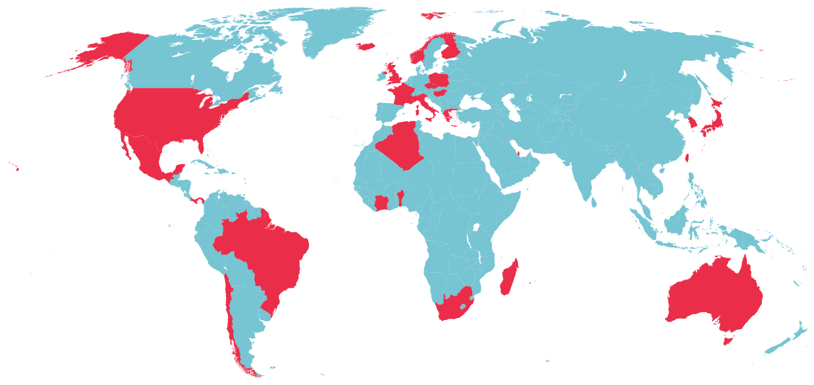

# Workalendar

----


----

# Peopleask

~~

# Action

> affecter une date prévue de traitement (généralement contractuelle) à J+10 **jours ouvrés**

~~

# Fastoche !

* On déroule les jours,
* Si ouvré on *incrémente*,
* Si férié **OU** samedi/dimanche on *skippe*

~~

# Jours ouvrés ?

~~

# Jours fériés ?

~~

# Recherche

~~


~~


~~


# Recherche

* un module très pointu: ``icelandic_holidays``,
* un autre tout aussi pointu: ``czech-holidays``.
* un module Brazil + UK + Poland (MAIS POURQUOI ?),

et... ?

~~

# Techniquement

* trop centrés sur un pays
* pas ou peu extensibles
* pas possible de passer outre certaines dates
* pas de fonction du genre *"J + 7 jours ouvrés"*

~~

# ...

> Parfois le meilleur moyen d'avoir une roue ronde c'est de la faire soi-même

~~

# Naming things

```irc
< brunobord> oyez, oyez
< brunobord> je cherche un nom pour le module de calendrier
             mondial
< brunobord> allez-y
< zebuline> workalendar ?
< Hobbestigrou> ah oui c'est pas mal
< Hobbestigrou> je trouve
< brunobord> je note
```

----

# Objectifs

* Boîte à outils -> calendrier France + *LE MONDE* ?!?
* Extensible / Modulaire
* Fonctions intégrées (``is_working_day``, ``add_working_days``)
* Débrayable (forcer un jour travaillé ou chômé)

----

# État(s) du Monde

----


----

## Simple

# France

* Calendrier grégorien
* Fêtes Chrétiennes (Pâques variable, le reste est fixe)
* Jours fixes (15 août, 1er janvier, 14 juillet)

~~

## Moins simple

# U.K.

* Calendrier grégorien
* Fêtes Chrétiennes
* Pas de jours fixe

... donc ?

~~

# United Kingdom

> Si Noël tombe un samedi ou un dimanche, on décale au **lundi suivant**

~~

# US of A.


~~

## US of Alambiqué

* "Le premier lundi de mars",
* "Le second lundi d'octobre",
* "Le jour de l'élection présidentielle"

~~

## US of Alambiqué

* cas particuliers sur les états,
* les comtés,
* les villes,
* les administrations,
* ma salle de bains

----

# J'aime l'Islande

... Mais le calendrier Islandais ne m'a pas facilité la tâche.

~~

# Quiz:

## Quel jour est
## "le premier jour de l'été" ?

~~

# Le 21 JUIN !


~~

# Mais pas en Islande...

~~

# sumardagurinn fyrsti

> The premier jour de l'été (sumardagurinn fyrsti) est un jour férié en Islande qui est célébré le premier jeudi après le 18 avril (soit entre le 19 et le 25 April).

----

# Calendriers Religieux

~~

# Calendrier Chrétien

~~

# Calendrier(s) Chrétien(s)

Trois formes de calcul de Pâques :

* Grégorien
* Julien,
* Orthodoxe,

~~

# Want some more?

~~

# Le Calendrier lunaire !

~~

# Le Calendrier **luni-solaire** !

~~


~~

# Rappels

* mois lunaire == 29,530588 jours **en moyenne**
* une "année" lunaire 12 * 29 jours *environ* == 348j.
* une année solaire == 365,242201 jours

~~

# Merci

* le module ``datetime`` connaît les années bissextiles
* [Module ``lunardate``](https://pypi.python.org/pypi/lunardate/)

~~

# L'Islam

* Calendrier lunaire "pur"
* Deux fêtes peuvent arriver la même année solaire
* [Module ``calverter``](https://pypi.python.org/pypi/pyCalverter)

Jusqu'ici, tout va bien...

~~

# Argh n°1

> Ce calendrier [lunaire] diffère entre les sunnites et les chiites ; des écarts de près de deux jours peuvent se produire.  
> (source: Wikipedia)

~~


~~

# Argh n°2

> La majorité des musulmans insiste sur l'observation locale du croissant de lune pour marquer le début du ramadan, mais d'autres insistent sur le calcul de la nouvelle lune ou sur la déclaration saoudienne pour déterminer le début du mois.  
> (source: Wikipedia)

~~


~~

# Israël

* Calendrier hébreux
* calendrier lunaire aussi, mais différent,
* merci le [module ``pyluach``](https://pypi.org/project/pyluach/)

----

# Hello, l'astronomie !


~~

## Taiwan & Hong Kong

* Nécessitent le calcul du "terme solaire"
* Attention aux fuseaux horaires !
* Merci [PyEphem](https://pypi.python.org/pypi/pyephem/) <small>(more on this later)</small>

~~

# Japon

* Équinoxes !
* Attention aux fuseaux horaires (bis) !
* Merci PyEphem <small>(ouais, je tease, mais c'est pour voir si tu suis)</small>

----

# Ma baleine blanche

~~


~~

# Mongolie

<small>

> The Mongol year is composed of either 12 or 13 lunar months, each beginning and ending with a new moon. A thirteenth month is added every two or three years, so that an average year is equal to the solar year.  
> [wikipedia](http://en.wikipedia.org/wiki/Mongolian_calendar)

</small>

~~


----


----

## Principe de réalité

* 100% parfait, c'est inimaginable
* renvoyer des ``warnings`` quand on sait qu'on est approximatif
* laisser la possibilité de rajouter ses exceptions

----

# À l'horizon...

* 139 pays à l'O.N.U.
* 249 pays dans ``django-countries``
* ... et les variantes régionales (USA, Australie, Inde...)

----

# À commencer par...

----

# Alsace/Moselle


~~

# Alsace/Moselle

== France + Vendredi Saint + 26 Décembre

----

# Buzz ?

----

# Calendriers de l'Avent

* [24 ways](http://24ways.org/)
* [24 jours de web](http://www.24joursdeweb.fr/)
* ...

----

# décembre 2013

* Un calendrier de l'avent des Calendriers
* Un nouveau Pays (et ses variantes) par jour
* Essayer de couvrir les 5 continents rapidement
* Accepter les contributions extérieures

----

# 24

Australia, *United Kingdom*, South Africa, **Alsace / Moselle**, **Japan**,
Benin, Italy, *Brazil*, Algeria, Northern Ireland, Mexico, Ivory Coast,
Hungary, São Tomé, Norway, Qatar, Chile, **Taiwan**, Marshall Islands,
*Poland*, Panama, Greece, Madagascar, Finland

<small>en gras, ce sont les contributions extérieures,<br/>
en italique, les pays pour lesquels on avait du code pré-existant.</small>

----



<small>31/12/2013</small>

----

# En conclusion...

----


----

# Merci

----

# Questions ?
